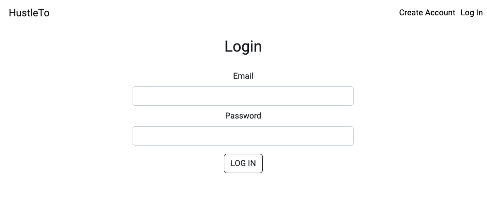

# HustleTo - Your Best Local Sneaker Shop

## Test credential

- Admin Role:

  - email: admin@gmail.com
    password:123456

- Customer Role:
  - email: test@gmail.com
    password:123456

## Product Page

### Landing Page

- Customer can browse the entire website, but only login user can add product to cart and checkout.

### Detail Page

- After login, customer can add product to cart.

### Cart Page

- Customer can checkout from cart page. The checkout uses Stripe API.

### Order History Page

- Customer can manage their order in order history page.

## Create Account/Login Page

- Customer can create accounts

- Registered customer can login to access more futures

## Admin Page

### Admin Navbar

- Admin will have a different header with admin account login, they can create/update/delete products, banners etc.

### Admin Create Inventory

- Admin add inventory in 'Add Inventory' Page

### Admin Inventory List

- All inventory are listed in inventory page

### Admin Inventory Detail

- Admin can delete/update inventory information/sizes on 'Inventory Detail' Page

## Banner Page

- Admin can add/delete banners in 'Banner' page. All banners will be displayed in landing page (curousal).

# Technologies Used

- Atlas MongoDB
- Express.js
- React.js
- Node.js
- Bootstrap
- CSS
- AWS S3
- Heroku

# Getting Started

- The Link to HustleTo deployed on heroku, can be found below.

  https://hustle-to.herokuapp.com/
