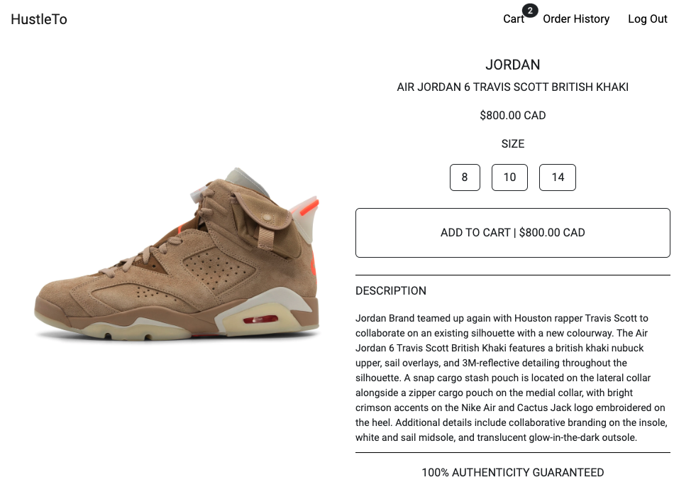

# HustleTo - Your Best Local Sneaker Shop

## Product Page

### Landing Page

- Customer can browse the entire website, but only login user can add product to cart and checkout.

### Detail Page

- After login, customer can add product to cart.

### Cart Page

- Customer can checkout from cart page. The checkout uses Stripe API.

## Create Account/Login Page

- Customer can create accounts

- Registered customer can login to access more futures (future)

## Admin Page

### Admin Navbar

- Admin will have a different header when they login, they will have access to create/update/delete products, banners etc.

### Admin Create Inventory

- Admin add inventory by creating them in 'Add Inventory' Page

### Admin Inventory List

- All inventory are listed in inventory page

### Admin Inventory Detail

- Admin can delete/update inventory on 'Inventory Detail' Page

## Banner Page

- Admin can add/delete banners in 'Banner' page. All banners will be displayed in this page, and also in landing page.

# Technologies Used

- Atlas MongoDB
- Express.js
- React.js
- Node.js
- Bootstrap
- CSS
- AWS S3
- Railway

# Getting Started

- The Link to HustleTo deployed on Railway, can be found below.

  https://hustle-to.up.railway.app/

# Next Steps

- Add more relations on backend
- Increase UX/UI design
- Filter/Sort and more functions
- Links on footer section
- Add cart/Check out page/functions
